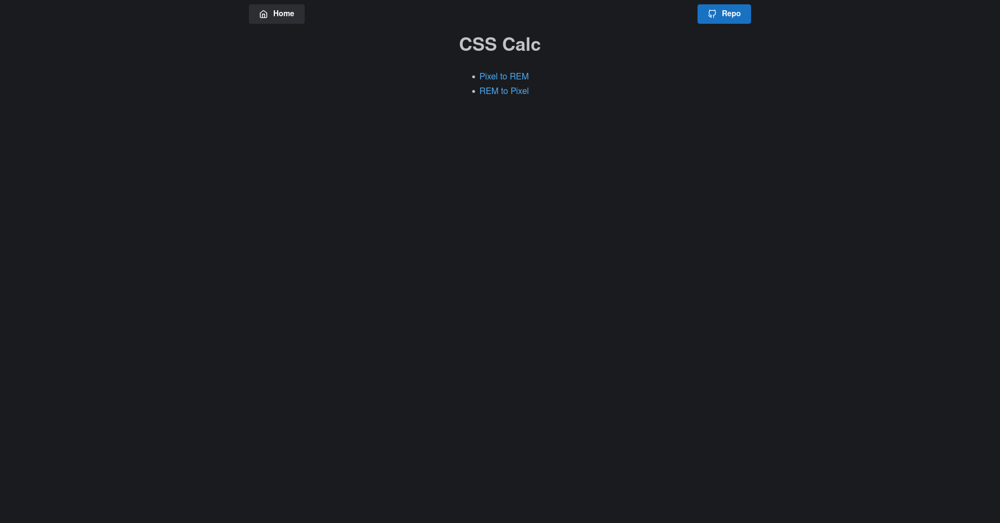

# [CSS calc](https://csscalc.surge.sh/)

[](https://github.com/prettier/prettier)
[](https://github.com/malcodeman/css-calc/blob/master/LICENSE)

Simple unit conversion tool.



## Getting started

```
git clone https://github.com/malcodeman/css-calc.git
cd css-calc
yarn install && yarn start
```

## License

[MIT](./LICENSE)
